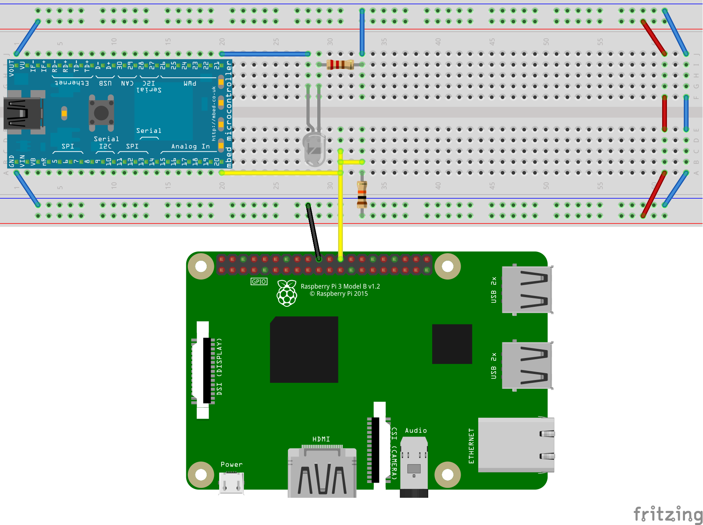
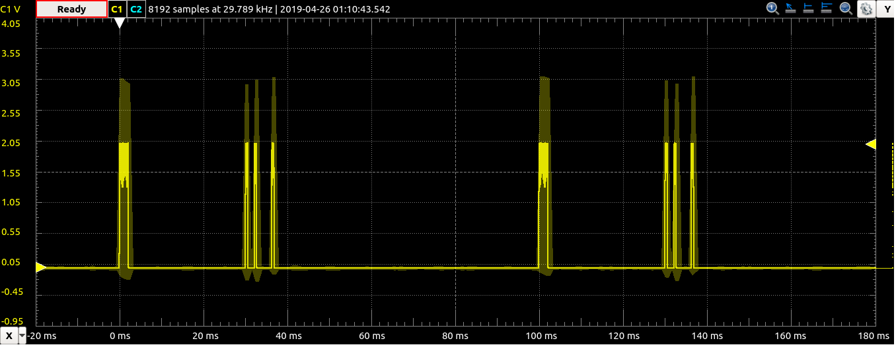
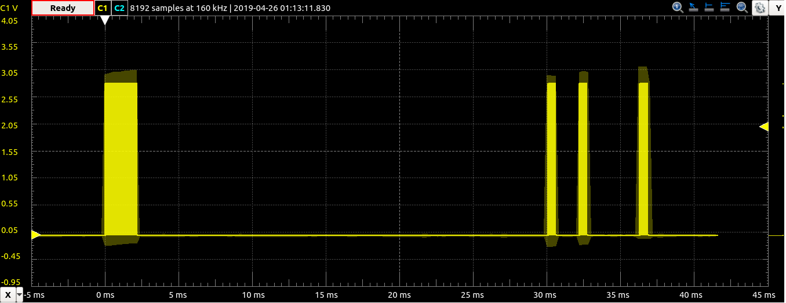
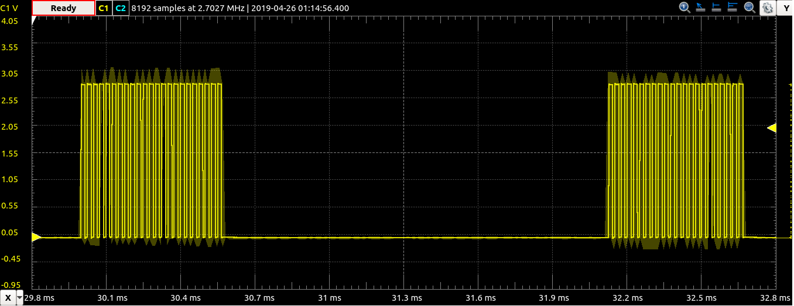

# Web Programmable DSLR Intervalometer
Wirelessly programmable timelapses for Nikon DSLRs using mbed and Raspberry Pi

Developed and maintained by:
- Mufutau Akuruyejo @MufuteeVC
- Daniil Budanov @danbudanov
- Georgiy Pyantkovsky @Georgiyukr

## Description
In this project, we combine a **Raspberry Pi**-based webserver with an embedded 
system running on the ARM **mbed**-enabled LPC1768 microcontroller to operate
timelapses with user-defined intervals and durations on any Nikon DSLR
supporting the Nikon ML-L3 IR Remote interface.

A `Flask` web server runs on the Pi and provides a web interface to configure the
timelapse. Once enabled, the Pi sends a trigger signal to the mbed periodically
throughout the specified duration in seconds. The mbed modulates a `38.4 kHz`
waveform with a control signal and transmits this using an IR LED to the camera. 

Once a photo is taken, `twilio` is used to send an SMS notification to the user's
phone that a photo has been taken. The user is able to start and stop the
timelapse's operation at any time, as well as to fire a test image, using the
web interface.

## Hardware Setup
The system is wired as follows:


A `QED-123 880nm IR LED` is connected to the `mbed` microcontroller's `p21` in
series with a `220 ohm` current limiting resistor. A wire connects the
Raspberry Pi's `GPIO8` to the mbed's `p20`, and this node is pulled up through
a `10k` resistor.

All signalling operates on `3.3 V` logic.

## Software
### Firmware
Microcontroller firmware has been developed using the online
[mbed Compiler IDE](https://ide.mbed.com/compiler) and can be found in the
[DslrIrLib repository](https://os.mbed.com/users/danbudanov/code/DslrIrLib/) and
in the [mbed directory](mbed) of this repository.

The firmware code is located in [main.cpp](mbed/main.cpp) and contains a simple
infinite `while` loop that checks the `trigger` input and commands
a `DslrIr` object to transmit a binary waveform through the IR LED whenever
the `trigger` input is `0`. 

The most challenging firware component was to
properly define this waveform, which is transmitted in the `DslrIr::trigger()` 
method.

The `DslrIr` class is defined in the [DslrIr library](mbed/DslrIr), and can be
bound to any PWM pin on the mbed microcontroller by instantiating the DslrIr
object with the appropriate pin name. For instance, in this project's *main.cpp*
the `p21` PWM pin is made into a DslrIr pin by including the `DslrIr.h` header:
```cpp
#include "DslrIr.h"
```
and instantiating the `DslrIr` object on pin `p21`:
```cpp
DslrIr dslr(p21);
```

#### Signal generation
The signal generation sequence is defined in `DslrIr::trigger()`. 
In the [Bayesian Adventures Blog](https://bayesianadventures.wordpress.com/2013/08/09/nikon-ml-l3-ir-remote-hack/),
the authors have torn apart an existing Nikon ML-L3 IR DSLR remote and mapped
the waveform it produces, as shown below:


It should be noted that a baseband on-off keyed waveform is modulated onto a
`38.4 kHz`, approximately `2/3` duty cycle carrier waveform. This is then 
transmitted through the IR LED, and receiver circuitry on the DSLR captures this
data. 
Developers at *Bayesian Adventures* then hacked an Arduino Uno to transmit a 
similar sequence into an IR LED using carefully timed pulses of both carrier and
baseband waveforms. The initial approach was to reproduce this timing on the mbed,
yet inconsistencies between the mbed and Arduino made these microsecond-precision
timing difficult.

Further research yielded an attempt to reproduce these results on the mbed in
the [DSLR_CAMERA_IR_REMOTE](https://os.mbed.com/users/viswesr/code/DSLR_Camera_IR_Remote/)
repository. This code generates the carrier waveform using PWM instead of
`wait()` commands; however, imprecise timing and an incorrect duty cycle 
rendered the current configuration of the code inoperable. Thus, using a
painstaking process of comparing a "golden" waveform from an Arduino running the
prior code and modifying a parameterized version of the latter, extensive
analysis on a *Digilent Analog Discovery 2* portable oscilloscope eventually
yielded parameters for the proper waveform:



The information signal is very precisely timed:


And is modulated using OOK on top of the carrier wave:


This code is than packaged into a more modular `DslrIr` library.


### Overall Architecture

### Hardware Specification

### Software Specification
- Flask for creating the web page
- Twilio for sending SMS

### Manual
- The user sets the interval and how long the shots should be taken on the webpage.
- Upon turning the power on, the system goes online
- Pictures are taken automatically and stored in the SD Card
- SMS sent to phone indicating process done

### Demo
- 
